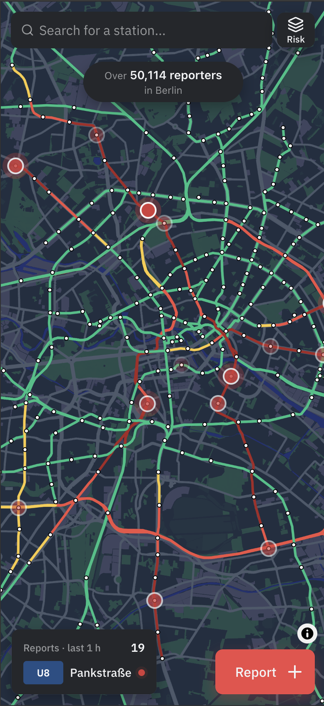
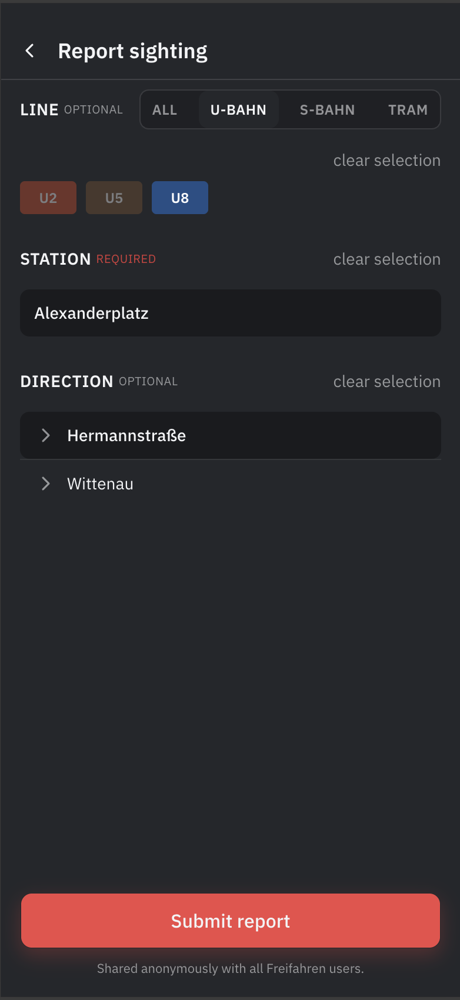

  

  
Die Blitzer-App für Öffis. Die Live-Karte der Ticketkontrolleure im Berliner Nahverkehr

  
  
  
  

---

## What is FreiFahren?

FreiFahren crowdsources real-time sightings of ticket inspectors across the Berlin public transport network. Reports flow in from the in-app form or the [Freifahren Telegram group](https://t.me/freifahren_BE); The community keeps the map accurate.

  
  &nbsp;&nbsp;
  

---

## How it works

1. **Report**: community members spot a ticket inspector and submit the station, line and direction via the web app or the [Telegram group](https://t.me/freifahren_BE)
2. **Process**: the backend validates the report and writes it to the database
3. **Display**: the live map updates in real-time so everyone can see where inspectors are right now

## Contact

Questions or feedback? Reach us at [contact@freifahren.org](mailto:contact@freifahren.org).

Or personally via [johan@freifahren.org](mailto:johan@freifahren.org), [moritz@freifahren.org](mailto:moritz@freifahren.org) or [david@freifahren.org](mailto:david@freifahren.org).
