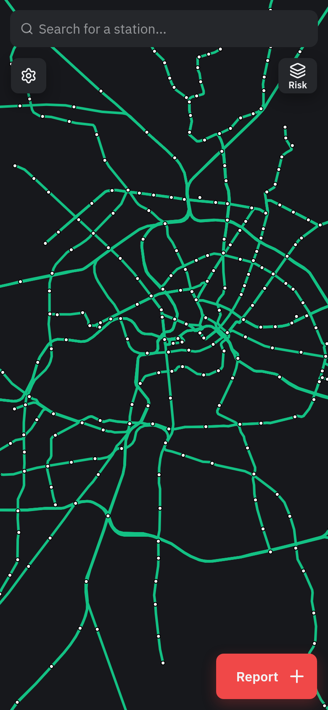
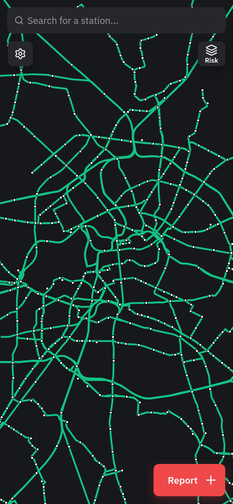
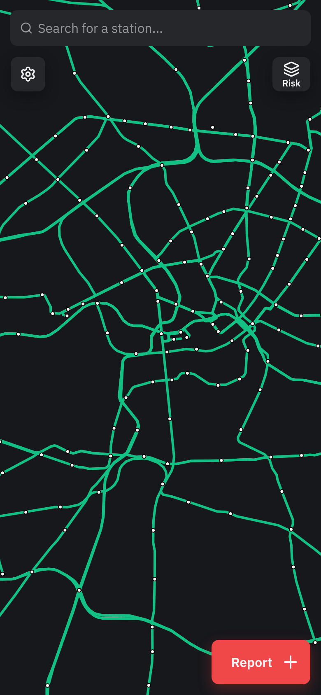
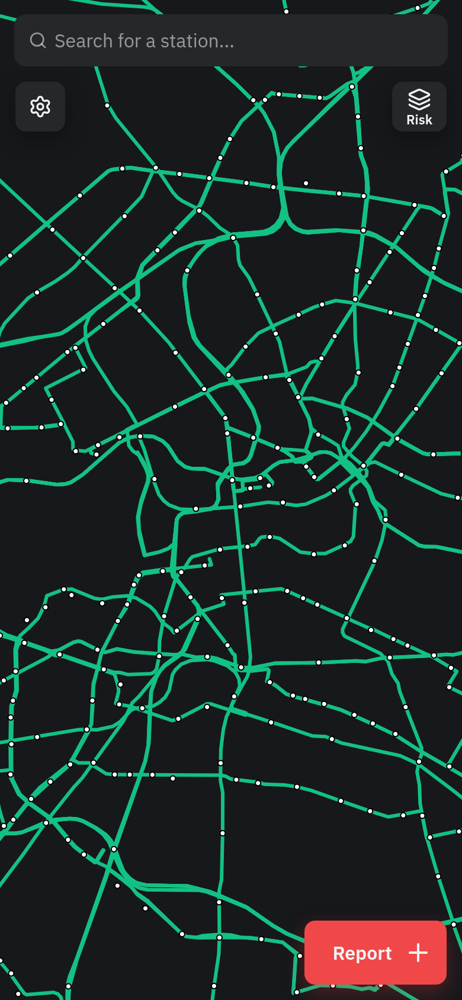
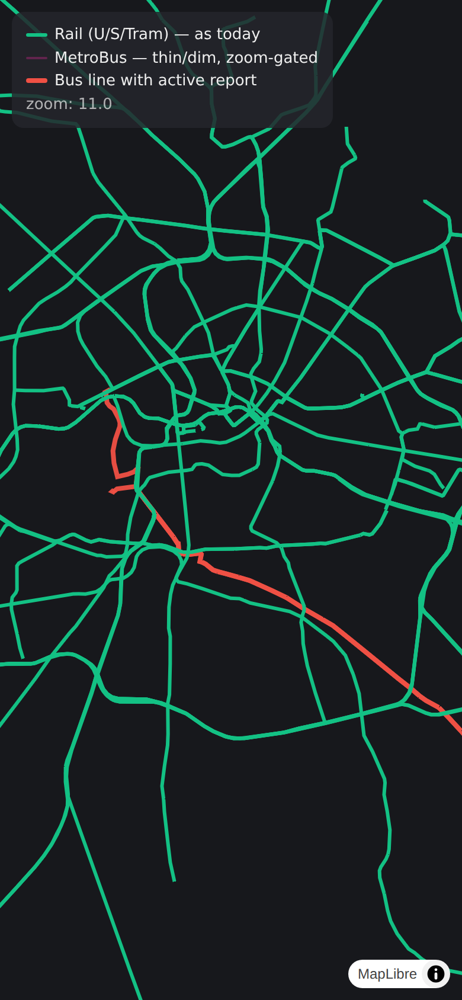
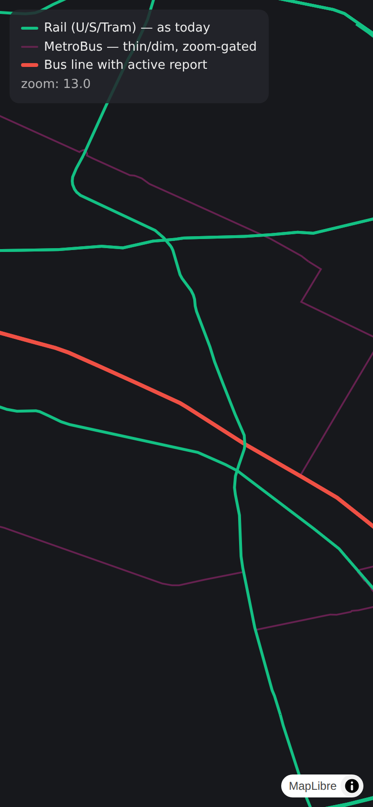

# Bus support: performance & display investigation (Berlin MetroBus)

Measured on a real local A/B setup: two `wrangler dev` instances of the
unchanged `api-worker` codebase, one seeded with the current Berlin reference
data, one with the same data **plus all 19 BVG MetroBus lines** (M11–M85)
fetched live from Overpass and run through the normal seed pipeline. Tooling:
[`packages/api-worker/benchmarks/`](../../packages/api-worker/benchmarks/README.md).
Frontend numbers come from production Vite builds of `frontend-next` driven by
headless Chromium against each instance.

MetroBus was chosen as the scope: BVG operates ~300 bus lines, but only the
Metro network runs frequently enough to be checked and reported in practice.
The seed config now supports exactly this scoping
(`seed.routeRefPatterns: { bus: '^M\\d+$' }` in `@freifahren/cities`).

## Data volume

19 MetroBus refs → 26 line variants, ~450 new bus-only stops. Bus stops within
250 m of a same-named rail station merge into it (existing proximate-merge), so
interchange stops don't duplicate.

| D1 table        | baseline | +MetroBus | Δ     |
| --------------- | -------- | --------- | ----- |
| `stations`      | 639      | 1,089     | +70 % |
| `lines`         | 55       | 81        | +47 % |
| `line_stations` | 1,465    | 2,229     | +52 % |
| `segments`      | 1,410    | 2,148     | +52 % |

## API payloads

| endpoint               | raw                  | gzip                | brotli              |
| ---------------------- | -------------------- | ------------------- | ------------------- |
| `/v0/transit/stations` | 78 → 134 KiB (+71 %) | 17.1 → 28.7 KiB     | 13.6 → 22.5 KiB     |
| `/v0/transit/lines`    | 22 → 34 KiB (+55 %)  | 4.4 → 7.1 KiB       | 3.8 → 6.0 KiB       |
| `/v0/transit/segments` | 452 → 647 KiB (+43 %)| 79.4 → 111.3 KiB    | 50.1 → 72.1 KiB     |

Over the wire (brotli, which Cloudflare serves): the whole overlay dataset goes
from ~68 KiB to ~101 KiB — **+33 KiB once per client per reseed** (30-day edge
cache + ETag revalidation are unchanged; repeat visits are 304s either way).

## Latency (local workerd; deltas are the signal, absolutes are not production)

| endpoint p50            | baseline | +MetroBus |
| ----------------------- | -------- | --------- |
| stations (edge hit)     | 11.9 ms  | 12.6 ms   |
| segments (edge hit)     | 23.8 ms  | 27.1 ms   |
| stations (cache miss)   | 17.5 ms  | 27.3 ms   |
| segments (cache miss)   | 39.9 ms  | 58.3 ms   |
| `/v0/risk`              | 19.7 ms  | 24.5 ms   |
| `/v0/transit/distance`  | 25.8 ms  | 34.1 ms   |

## D1 rows read (what Cloudflare bills)

Query plans verified on the seeded SQLite files — every reference load stays
index-backed, no O(n²) join appears with the larger tables. Approximate rows
scanned per request:

| query path                     | baseline | +MetroBus |
| ------------------------------ | -------- | --------- |
| stations load (edge-cache miss)| ~3.6 k   | ~5.5 k    |
| lines load (miss)              | ~1.5 k   | ~2.3 k    |
| segments load (miss)           | ~1.4 k   | ~2.1 k    |
| **`/distance` (every request)**| ~2.2 k   | ~3.4 k    |

The three reference endpoints only hit D1 on an edge-cache miss (per colo, per
reseed/purge), so their growth is irrelevant for billing. The one path that
reads D1 **on every request** is `/v0/transit/distance` (`loadGraph` scans
stations + line_stations + lines and is not behind `cachedReference`). Even so:
at 100 k distance requests/day the bus variant reads ~10 B rows/month vs ~6.5 B
baseline — both inside the 25 B rows included in Workers Paid; beyond that D1
costs $0.001 per million rows, i.e. ~$3–4/month per extra billion.

**Recommendation independent of buses:** wrap `loadGraph` in `cachedReference`
like the other three loads. That removes the only per-request D1 scan, and the
rows-read question disappears entirely (bus or no bus).

## Page load (production build, headless Chromium, 4× CPU throttle + 20 Mbit/40 ms)

| metric                     | baseline | +MetroBus |
| -------------------------- | -------- | --------- |
| time to settled map        | 5.49 s   | 5.47 s    |
| domComplete                | 854 ms   | 879 ms    |
| JS heap after load         | 16.0 MB  | 15.9 MB   |

No measurable page-load impact: basemap tiles and the app bundle dominate; the
overlay fetches finish off the critical path in both variants. MapLibre renders
2.1 k vs 1.4 k line features without visible frame cost (GeoJSON of this size
is far below MapLibre's limits).

## Seed pipeline

Local seed time 6.3 s → 12.2 s (proximate-merge is O(n²) over stations — fine at
1.1 k). The Overpass refresh grows by 4 batched queries (~2 min including the
politeness cooldowns).

## The real problem is display, not performance

Left: today's network. Right: MetroBus added naively (same risk-layer
treatment). Every segment gets the same neutral green, so the network hierarchy
disappears and station dots double:

| baseline (z11)                      | naive MetroBus (z11)                |
| ----------------------------------- | ----------------------------------- |
|           |           |

| baseline (zoomed, ≈z12)             | naive MetroBus (zoomed, ≈z12)       |
| ----------------------------------- | ----------------------------------- |
|           |           |

### Recommended treatment (prototyped with the real data)

Most bus lines carry no reports most of the time, so they should not compete
with rail at city scale:

1. **Buses in their own layers, zoom-gated and de-emphasized.** Hidden below
   z≈11.5; from there thin (0.8 → 2.5 px) and translucent (0.3 → 0.85) in one
   muted VBB purple. Bus-only stops appear from z≈13 with small markers.
2. **Reports promote the line.** A bus line with an active report (or elevated
   risk) renders at full width/opacity at any zoom — buses only demand
   attention when something is happening on them.
3. **Risk layer stays rail-first.** Don't paint neutral-green bus segments;
   only risky bus segments get color. (The naive screenshots above show why.)
4. **Report flow:** group Bus after U/S/Tram in pickers (`compareLineOrder`
   already orders `bus` last).

| strategy demo, z11 — quiet buses invisible, reported M41 promoted | z13 — unreported buses appear thin & dim |
| ----------------------------------- | ----------------------------------- |
|               |               |

## Verdict

- **API/page-load/query cost: no blocker.** Payload +33 KiB brotli once per
  reseed per client, D1 rows-read growth only matters on `/distance` (fix by
  caching the graph), risk model +5 ms, page load unchanged.
- **Cloudflare bill: negligible** at current traffic; reference data is served
  from the edge cache 30 days at a time.
- **Display needs the treatment above** — naively adding buses to the current
  layers makes the map unreadable and buries the rail network users actually
  report on.
- **Scope stays curated:** `routeRefPatterns` keeps Berlin at MetroBus only;
  all ~300 BVG lines would be a different story (≈6× today's data) and isn't
  justified by report volume.

### Rollout steps (when/if decided)

1. `bun db:seed:refresh --city berlin` (picks up MetroBus via the new config)
2. `bun run seed --city berlin --remote`, then `bun db:purge-cache`
3. Frontend: implement the bus layer treatment (point 1–4 above)
4. Optional but recommended first: put `loadGraph` behind `cachedReference`
